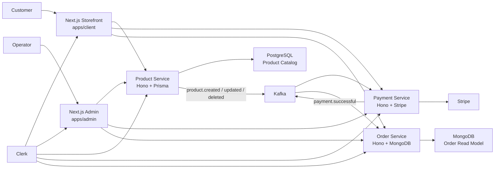

# Commerce Platform Monorepo

A production-style ecommerce platform built to showcase modern full-stack engineering: a Bun-first Turborepo, Next.js storefront and admin apps, typed Hono microservices, Clerk authentication, Stripe checkout, Kafka event flow, PostgreSQL, MongoDB, and hardened Docker orchestration.

This is not a single demo app in a big folder. It is a real distributed commerce system with clear service ownership, shared contracts, event-driven integration, CI quality gates, and local workflows that let you run either the whole platform or only the pieces you are actively developing.

## Highlights

- **Turborepo workspace** with strict environment pass-through, task caching, package boundaries, and shared TypeScript config.
- **Customer storefront** in `apps/client` with catalog browsing, search, filters, cart state, checkout, order return flow, SEO metadata, sitemap, and service diagnostics.
- **Admin operations app** in `apps/admin` for product/catalog operations, customer/order visibility, payment events, service health, and Kafka-backed payment activity.
- **Typed Hono microservices** for product, payment, and order domains, all with Zod contracts, OpenAPI metadata, Scalar API docs, structured error payloads, request IDs, CORS, compression, secure headers, timing, and readiness endpoints.
- **Clerk auth everywhere it matters**: Next.js auth UI, service middleware, bearer-token authorization, admin role/session-claim checks, and local `ADMIN_USER_IDS` recovery support.
- **Kafka integration** for catalog sync and payment/order workflows with typed topics, durable topic defaults, instrumentation hooks, and explicit topic creation.
- **Stripe checkout** with checkout sessions, webhook handling, payment success publication, and payment event visibility in the admin app.
- **Polyglot persistence** with Prisma/PostgreSQL for product catalog writes and a Kafka-fed MongoDB read model for orders.
- **Hardened Docker stack** using Docker Hardened Images, Traefik TLS routing, Kafka UI, health waits, read-only app containers, capability drops, and reproducible image locking support.
- **CI-grade standards**: Biome, Syncpack, Knip, Bun tests with coverage, Bun audit, type checking, Next builds, Compose validation, Docker image builds, SBOM, and provenance.

## System Map



For deeper boundary, event, and runtime notes, see [docs/ARCHITECTURE.md](docs/ARCHITECTURE.md).
For engineering standards and verification policy, see [docs/QUALITY.md](docs/QUALITY.md).

## Apps And Packages

| Workspace | Responsibility |
| --- | --- |
| `apps/client` | Customer storefront, cart, checkout, orders, product pages, diagnostics, SEO routes |
| `apps/admin` | Admin dashboard for catalog, users, payments, service health, and integration events |
| `apps/product-service` | Catalog/category API, Prisma writes, product Kafka event publication |
| `apps/payment-service` | Stripe checkout sessions, webhooks, catalog sync consumer, payment event publication |
| `apps/order-service` | Order API backed by Kafka-fed MongoDB read model |
| `packages/api-client` | Typed service client used by Next.js apps and tests |
| `packages/types` | Shared Zod schemas, API records, auth claims, pricing/cart/order types |
| `packages/hono-utils` | Shared service app factory, auth middleware, OpenAPI helpers, health/runtime utilities |
| `packages/kafka` | Typed Kafka client, producer, consumer, topic admin, instrumentation |
| `packages/product-db` | Prisma schema, generated client, Postgres connection |
| `packages/order-db` | MongoDB models and connection helpers |
| `packages/typescript-config` | Shared TypeScript presets |

## Tech Stack

| Layer | Technology |
| --- | --- |
| Monorepo | Turborepo, Bun workspaces, Bun catalogs |
| Frontend | Next.js 16, React 19, Tailwind CSS 4, Radix UI, Lucide |
| APIs | Hono, Zod, OpenAPI, Scalar API Reference |
| Auth | Clerk for frontend sessions and service bearer auth |
| Payments | Stripe Checkout and webhooks |
| Events | Kafka with typed topics and topic management |
| Data | PostgreSQL + Prisma, MongoDB + Mongoose |
| Quality | Biome, Syncpack, Knip, Bun test/coverage, Bun audit, TypeScript native preview |
| Runtime | Bun, Docker Compose, Traefik, Docker Hardened Images |
| CI/CD | GitHub Actions, Docker Buildx, GHCR images, SBOM, provenance |

## Event Flow

1. Product admins create/update/delete catalog products in `apps/admin`.
2. `product-service` validates payloads with shared Zod schemas, writes through Prisma, and publishes catalog events to Kafka.
3. `payment-service` consumes catalog events and keeps Stripe product/price state aligned.
4. Customers browse and check out through `apps/client`.
5. Stripe webhooks land in `payment-service`, which publishes `payment.successful`.
6. `order-service` consumes successful payment events and updates the MongoDB order read model.
7. Storefront and admin apps query typed APIs through `packages/api-client`.

## Prerequisites

- `Bun >= 1.3.14`
- `Node >= 20.19.0`
- Docker with Compose
- `mkcert` for locally trusted `*.localhost` TLS certificates
- `docker login dhi.io` if you want the full Docker Hardened Images path

Start with the guided command list:

```bash
make help
```

Or run the repository doctor for a quick readiness check:

```bash
bun run doctor
```

## Quick Start

### Full Platform With Docker

Use this for the complete showcase: Traefik, TLS local domains, storefront, admin, product/payment/order services, Postgres, MongoDB, Kafka, Kafka UI, and Stripe CLI webhook forwarding.

```bash
make setup
make docker-up-build
```

Main URLs:

| Surface | URL |
| --- | --- |
| Storefront | `https://shop.localhost` |
| Admin | `https://admin.localhost` |
| API gateway | `https://api.localhost` |
| Kafka UI | `https://kafka.localhost` |
| Traefik dashboard | `https://dashboard.localhost/dashboard/` |

Useful follow-ups:

```bash
make status
make docker-ps
make docker-logs
make docker-down
```

### Local App Development

Use this when you want apps and services running locally over HTTP while Postgres, MongoDB, and Kafka run in Docker:

```bash
make local-dev
```

This target creates local env files, installs dependencies, starts infrastructure, runs Prisma migrations, seeds catalog data, prints URLs, and starts Turbo dev processes.

Raw equivalent:

```bash
make setup-base
make docker-infra-local
make local-env-file
make local-db-migrate
make local-db-seed
bun --env-file=/tmp/ecommerce-local-dev.env run dev
```

Local URLs:

| Surface | URL |
| --- | --- |
| Storefront | `http://localhost:3002` |
| Admin | `http://localhost:3003` |
| Product API | `http://localhost:3000/products` |
| Order API | `http://localhost:8001/api/orders` |
| Payment API | `http://localhost:8002/api/session` |
| Storefront diagnostics | `http://localhost:3002/diagnostics` |

## Quality Gates

Run the same checks the repo is designed around:

```bash
bun run doctor
bun run deps:outdated
bun run deps:check
bun run lint
bun run knip
bun run test
bun run check-types
bun run build
```

Or run the curated gate:

```bash
bun run ci:verify
```

For the broadest local confidence check, including environment and Compose readiness:

```bash
bun run verify:full
```

What the gates cover:

- dependency freshness and catalog consistency
- formatting/lint policy with Biome
- unused exports/dependencies with Knip
- shared contract and integration unit tests
- TypeScript checks across every package
- production builds through Turborepo
- vulnerability audit at moderate severity or higher

## Clerk Setup

The stack can start without live Clerk keys, but authenticated checkout and admin writes need Clerk configured.

Set these in `.env`:

```bash
NEXT_PUBLIC_CLERK_PUBLISHABLE_KEY=pk_...
CLERK_SECRET_KEY=sk_...
```

Admin authorization uses a small session claim. In the Clerk Dashboard, add:

```json
{
  "role": "{{user.public_metadata.role}}"
}
```

Then set the target Clerk user's public metadata:

```json
{
  "role": "admin"
}
```

For local recovery while setting up Clerk, `.env` can include:

```bash
ADMIN_USER_IDS=user_...
```

## Stripe Setup

Checkout and webhook behavior require Stripe keys:

```bash
NEXT_PUBLIC_STRIPE_PUBLISHABLE_KEY=pk_...
STRIPE_SECRET_KEY=sk_...
STRIPE_WEBHOOK_SECRET=whsec_...
```

The Docker workflow can run Stripe CLI webhook forwarding. The payment service records recent checkout, webhook, Kafka, and Stripe events so the admin dashboard can show integration activity without digging through logs.

## Docker And Security Posture

The Docker path uses Docker Hardened Images for Bun, Traefik, Postgres, Kafka, and MongoDB. The Compose stack includes:

- TLS routing through Traefik for local `*.localhost` domains
- explicit Docker provider constraints so only labelled services are routed
- read-only app containers and dropped Linux capabilities
- health checks and readiness waits
- private service network with minimal published ports
- image freshness checks and optional digest lockfile generation

### Container Topology

| Container | Image / Build | Purpose |
| --- | --- | --- |
| `ecommerce-traefik` | `dhi.io/traefik:3.7-debian13` | TLS router, API gateway, dashboard |
| `docker-socket-proxy` | `tecnativa/docker-socket-proxy:v0.4.2` | Restricted Docker API surface for Traefik discovery |
| `ecommerce-postgres` | `dhi.io/postgres:18-debian13` | Product catalog database |
| `ecommerce-mongodb` | `dhi.io/mongodb:8.3-debian13` | Order read-model database |
| `kafka-broker-1..3` | `dhi.io/kafka:4.2-debian13-native` | Three-broker Kafka cluster |
| `ecommerce-kafka-ui` | `ghcr.io/kafbat/kafka-ui:v1.5.0` | Kafka topic, consumer, and message visibility |
| `ecommerce-product-service` | `docker/Dockerfile.product-service` | Catalog API, Prisma writes, product events |
| `ecommerce-payment-service` | `docker/Dockerfile.payment-service` | Stripe checkout, webhooks, payment events |
| `ecommerce-order-service` | `docker/Dockerfile.order-service` | Order API and MongoDB read model |
| `ecommerce-client` | `docker/Dockerfile.client` | Customer storefront |
| `ecommerce-admin` | `docker/Dockerfile.admin` | Admin operations dashboard |
| `stripe-cli` | `stripe/stripe-cli` pinned by digest | Local webhook forwarding |

The five application Dockerfiles use Turbo pruning, Bun frozen installs, and hardened Bun runtime images. Frontend images build standalone Next.js output, while service images copy only runtime code, generated clients, shared packages, and production dependencies.

Useful Docker commands:

```bash
make docker-test
make docker-build
make docker-up-build
make docker-smoke
make docker-lock-images
make docker-down-volumes
```

Before full Docker workflows, authenticate with Docker Hardened Images:

```bash
docker login dhi.io
make docker-auth
```

## API Documentation

Each Hono service exposes typed OpenAPI metadata and Scalar docs through the service app factory. In local development, use the direct service URLs; in Docker, use `https://api.localhost` routing for public API paths.

Core API groups:

- product catalog: `/products`, `/categories`
- checkout: `/api/session/create-checkout-session`
- checkout status: `/api/session/status`
- orders: `/api/orders`
- Stripe webhooks: `/api/webhooks/stripe`
- health/readiness: `/health`, `/ready`

## Repository Standards

- Shared API contracts live in `packages/types`; services and apps consume them instead of duplicating request/response shapes.
- Cross-app service calls go through `packages/api-client`.
- Service apps use `packages/hono-utils` for auth, error shape, request IDs, OpenAPI, CORS, secure headers, compression, timing, and readiness.
- Dependency versions are centralized in the root Bun catalog and enforced by Syncpack.
- Kafka topics and message payloads are typed in `packages/kafka`.
- Product mutations go through `product-service` so validation, database writes, and Kafka publication stay consistent.
- Docker workflows prefer pinned version tags plus optional digest locks for reproducibility.
