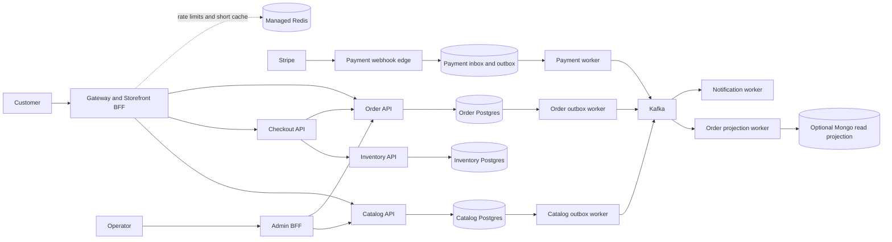

# Expert Microservices Improvement Plan

Assessment date: 2026-07-25

## Verdict

This is a strong production-style showcase, but it is not yet a production-proven ecommerce platform. The repository is ahead of most portfolio microservice projects in monorepo discipline, typed boundaries, transactional catalog events, payment idempotency, container hardening, Helm coverage, and developer experience. Its largest gaps are commerce correctness, durable message processing, workload separation, production data operations, end-to-end proof, and deployment policy.

The target should not be “the most services” or “the most tools.” It should be the smallest set of independently operable bounded contexts that can prove correctness under retries, partial failure, scaling, deployment, and recovery.

## Current Scorecard

Scores are an engineering assessment, not a benchmark certification.

| Area | Score | Evidence | Main gap |
| --- | ---: | --- | --- |
| Monorepo and developer experience | 8.5/10 | Bun catalogs, Turbo boundaries/cache controls, doctor commands, focused packages | Package-owned tests and repeatable performance budgets |
| Service boundaries and contracts | 7.5/10 | Product, payment, and order ownership; oRPC/Zod HTTP contracts | Event contracts are compile-time interfaces without runtime/version compatibility controls |
| Commerce correctness | 4.5/10 | Server-authoritative price checks, Stripe idempotency, idempotent order upsert | No inventory reservation, pending order, cancellation, refund, fulfillment, or compensation state machine |
| Event reliability | 6.5/10 | Kafka durability settings, idempotent producer, product transactional outbox | No durable webhook inbox, consumer inbox, retry topics, DLQ, poison-event policy, or schema registry |
| Data architecture | 5.5/10 | Database ownership and useful Postgres/Mongo separation | Order data is only a read model; no transactional order source of truth, backup/restore proof, or RPO/RTO |
| API and identity security | 7/10 | Clerk verification, ownership checks, admin authorization, secure headers | Public API surface is wider than necessary; no workload identity, distributed rate limit, or service-level authorization policy |
| Observability and SRE | 6/10 | Request IDs, trace context, structured metrics/logs, ServiceMonitors, alerts, dashboard | No real spans/collector/backend, exemplars, business SLIs, burn-rate alerts, or error-budget policy |
| Kubernetes workload quality | 7.5/10 | Probes, resources, PDBs, security contexts, soft topology spreading, Gateway API v1 option, Helm schema, digest-aware images, supported-version render matrix | NetworkPolicy and autoscaling are off by default; API and workers are coupled |
| Delivery and supply chain | 7/10 | CI gates, digest-pinned external images, immutable app-image support, multi-arch images, SBOM and provenance generation | No GitOps environment promotion, digest verification/admission, canary analysis, signed provenance verification, or pinned action SHAs |
| Test confidence | 5.5/10 | Fast unit/integration-style tests and build checks | No real-broker/database integration suite, browser checkout proof, load test, migration test, or failure/chaos test |

Overall: approximately 6.5/10 today. It is a credible advanced project, not yet the final reference architecture.

## Strengths To Preserve

- Keep the Bun/Turborepo catalog and package-boundary model.
- Keep server-authoritative checkout prices and Stripe idempotency keys.
- Keep the product transactional outbox and at-least-once mindset.
- Keep explicit liveness, readiness, resource requests, read-only filesystems, non-root users, dropped capabilities, and disabled service-account token mounting.
- Keep database ownership behind services. Never let a frontend or another service import a database package directly.
- Keep typed same-origin storefront routes for authenticated checkout.
- Keep local Docker and Kubernetes workflows, but distinguish local convenience profiles from production policy.

## Target Domain Architecture

Do not create every service on day one. Introduce a boundary when it owns a distinct consistency model, scaling profile, security profile, or release cadence.



Recommended bounded contexts:

1. **Catalog** owns product descriptions, categories, media references, and sellable product metadata.
2. **Inventory** owns SKU/variant availability and reservation state. Start as a clear module in the product service if team size is small; extract only when its consistency and scaling needs justify it.
3. **Order** owns the transactional order aggregate and lifecycle. PostgreSQL is the default source of truth. MongoDB can remain as a CQRS read projection if it demonstrates a real query benefit.
4. **Payment** owns Stripe references, webhook inbox records, payment attempts, refunds, and its outbox. It does not own catalog or order state.
5. **Notification/Fulfillment** are event-driven workers first. Promote them to separate APIs only if business workflows require it.

## Priority 0: Dependency And Toolchain Baseline

Status: implemented in this pass.

- Every directly upgradeable catalog dependency is current according to `bun outdated --recursive`; its only reported entry is the intentional TypeScript 6 API compatibility package described below.
- The old `@typescript/native-preview` nightly was removed.
- Stable TypeScript 7 is installed as `@typescript/native` and supplies the `tsc` binary.
- Stable TypeScript 6 remains installed directly as `typescript` because Next.js 16 needs the programmatic compiler API that TypeScript 7.0 intentionally does not expose. The official `@typescript/typescript6` bridge is not used because Bun 1.3.14 incorrectly resolves its nested `@typescript/old` alias back to the bridge itself, leaving the API empty.
- Turborepo is aligned at 2.10.6 in the workspace, CI, and Docker defaults.
- Stripe CLI is aligned at 1.44.0 in Compose and Helm.
- Prisma 7.9, PostgreSQL 18.4, Mongoose 9.8, MongoDB 8.3.4, and Bun 1.3.14 were checked against their current documentation and dependency metadata.
- Security overrides pin patched `fast-uri` 4.1.1, `valibot` 1.4.2, `find-my-way` 9.7.0, and `sharp` 0.35.3 releases until their direct dependents widen or update their ranges.
- Redis Open Source 8.8 documentation was reviewed, but this repository has no Redis package or runtime today. Do not add an unused datastore; introduce a managed Redis deployment only for a measured cache, rate-limit, or ephemeral coordination requirement, never as commerce state of record.
- Kafka was upgraded from 4.2 to 4.3.1, the current Apache release.
- Every external Compose image now uses an exact version and verified digest. The MongoDB DHI is currently amd64-only, so Compose declares that platform explicitly; Docker Socket Proxy also moved to its maintainer-recommended GHCR registry.
- The Bun Docker build/runtime bases are pinned to 1.3.14 tags and verified image-index digests in Dockerfiles and CI.
- Every Dockerfile pins the Dockerfile frontend at 1.25.0 with its verified multi-architecture digest.
- Docker Buildx is pinned to 0.35.0 in CI, and its BuildKit backend is pinned to the 0.31.2 security release and verified multi-architecture image digest instead of resolving mutable defaults.
- CI actions are pinned to immutable current-release commit SHAs, including `actions/checkout` 7.0.1 and `docker/login-action` 4.5.1.
- Traefik uses the official 3.7.8 security and bug-fix release with a verified multi-architecture image digest.
- Helm is pinned to 4.2.3 in CI through Azure Setup Helm 5.0.1. The application chart is now 0.3.0 and supports maintained Kubernetes 1.34 through 1.36.
- CI and `make helm-lint-supported` validate all chart profiles against Kubernetes 1.34.9, 1.35.6, and 1.36.2, the latest patches published by the canonical English release pages during this audit.
- Kubeconform 0.8.0 is digest-pinned and strictly validates all built-in rendered resources for every chart profile and supported Kubernetes patch; CRD-backed resources without core schemas are reported as skipped.
- Gateway API standard CRDs are pinned at 1.6.1, Traefik's chart at 41.0.2, and kube-prometheus-stack at 87.19.1.
- Helm application images accept SHA-256 digests, the Stripe CLI and curl test images are digest-pinned, and no chart default uses `latest`.

Keep these gates:

```bash
bun outdated --recursive
bun run deps:check
bun run check-types --force
bun run test
bun run build
bun run audit
```

Add Renovate with grouped catalog PRs, lockfile maintenance, minimum release age, and separate major-version PRs. Do not auto-merge runtime, database, auth, or payment majors.

## Priority 1: Make Commerce Correct Under Failure

Target: the platform can explain and recover every checkout state without relying on Stripe as the only system of record.

### 1. Create a transactional order source of truth

Replace “order appears only after `payment.successful`” with an order aggregate created before payment:

```text
DRAFT -> PENDING_PAYMENT -> PAID -> CONFIRMED -> FULFILLING -> SHIPPED -> DELIVERED
                       \-> PAYMENT_FAILED
                       \-> CANCELLED
PAID/CONFIRMED -> REFUND_PENDING -> REFUNDED | REFUND_FAILED
```

Store order lines as immutable purchase snapshots: product ID, SKU/variant, name, unit amount, currency, tax, discount, quantity, selected size/color, and image reference. Store Stripe session/payment-intent IDs, shipping address, customer ID, and timestamps. Never reconstruct a historical order from the live catalog.

### 2. Add inventory reservations

- Model inventory per SKU/variant rather than the current event field that always emits `stock: 0`.
- Reserve inventory with a database transaction and an expiry, using optimistic versioning or row locks.
- Confirm the reservation after payment and release it on expiry, cancellation, or payment failure.
- Make reserve, confirm, and release commands idempotent by order ID and reservation ID.
- Do not use Redis as the inventory source of truth.

### 3. Introduce a checkout saga

Use explicit orchestration for the small number of correctness-critical steps:

1. Create pending order.
2. Reserve inventory.
3. Create/reuse Stripe Checkout Session.
4. On paid webhook, record payment and confirm reservation.
5. Confirm order and emit `order.confirmed`.
6. On failure or expiry, release inventory and move the order to a terminal failure state.

Persist saga state and every compensation attempt. A process crash must resume, not restart the business transaction from memory.

### 4. Make webhook processing durable

The current webhook signature verification is good, but Kafka publication alone is not a durable inbox. Add a payment database with:

- `stripe_webhook_inbox(event_id unique, type, received_at, payload_hash, status, attempts, next_attempt_at, last_error)`
- `payment_attempt`
- `payment_outbox`

After signature verification, insert the event idempotently and acknowledge it. A worker claims inbox records, retrieves authoritative Stripe state, writes the payment update and outbox event in one transaction, then publishes. Retain payloads only as long as operational and privacy requirements justify.

Acceptance gates:

- Replaying the same Stripe event 100 times produces one payment transition and one logical order transition.
- Killing any process after each persistence/publish step still converges to the correct state.
- An expired or failed checkout releases inventory.
- Refund and cancellation paths are tested, not documented as future work.

## Priority 2: Harden Event Contracts And Workers

### 1. Standardize the event envelope

Every Kafka record should have runtime validation and an envelope such as:

```json
{
  "id": "uuidv7",
  "type": "payment.succeeded",
  "version": 1,
  "source": "payment-service",
  "subject": "order/123",
  "occurredAt": "2026-07-18T00:00:00.000Z",
  "correlationId": "...",
  "causationId": "...",
  "traceparent": "...",
  "payload": {}
}
```

- Define Zod schemas, not TypeScript interfaces alone.
- Validate before publish and after consume.
- Generate JSON Schema/AsyncAPI documentation.
- Add compatibility tests: backward-compatible additions are allowed; breaking changes require a new version/topic or an explicit migration.

### 2. Add inbox, retries, and dead-letter handling

- Add a durable consumer inbox keyed by consumer name and event ID for state-changing consumers.
- Add bounded exponential backoff with jitter.
- Route exhausted or invalid events to versioned retry/DLQ topics with error metadata.
- Add an admin replay command with audit records; never “fix” poison events by skipping offsets manually without evidence.
- Alert on DLQ depth, oldest retry age, consumer lag, and outbox age.

### 3. Split HTTP APIs from workers

Today the API server, outbox relay, Kafka consumers, and Stripe integration workers share processes and Deployments. Split them into independently deployable entry points and Helm workloads:

- `product-api` and `catalog-outbox-worker`
- `payment-api`, `stripe-webhook-edge`, `payment-worker`, and `stripe-catalog-worker`
- `order-api` and `order-projection-worker`

Scale HTTP workloads on request/latency signals. Scale Kafka workers with KEDA consumer lag, bounded by topic partition count. This prevents an HTTP HPA event from causing unnecessary consumer rebalances.

### 4. Revisit the Kafka client deliberately

KafkaJS 2.2.4 is the registry ceiling and this repo carries a Bun patch. Run a compatibility and throughput spike against Confluent's maintained JavaScript client before migrating. Require Bun compatibility, TLS/SASL, idempotent production, cooperative rebalancing, instrumentation hooks, and failure tests. Keep KafkaJS if the replacement does not beat the current client on correctness and operability.

Acceptance gates:

- A malformed event reaches a DLQ and does not crash-loop the entire consumer group.
- Worker replicas scale with lag without exceeding useful partition concurrency.
- API rollouts do not rebalance Kafka workers.
- Kafka connections use TLS and SASL/workload credentials outside local development.

## Priority 3: Production Kubernetes Profile

Keep the current local profile. Add a separate production values hierarchy and policy checks.

### Workload and routing

- Make Gateway API the production default; expose only storefront/admin BFF routes and the Stripe webhook edge. Keep service RPC endpoints cluster-internal.
- Add zone and hostname topology spread constraints plus preferred anti-affinity.
- Keep at least two replicas only for workloads whose SLO requires it; let event workers use KEDA where safe.
- Add graceful drain behavior: stop accepting work, fail readiness, finish bounded in-flight work, commit offsets, then exit within the termination grace period.
- Require immutable application image digests in production promotion. Chart-level digest rendering and removal of `latest` defaults are implemented; CI/CD still needs to inject each newly published application digest.

### Security

- Enforce the Kubernetes Restricted Pod Security Standard at namespace admission.
- Enable default-deny ingress and egress. Allow only Gateway-to-BFF, BFF-to-service, service-to-owned-database/Kafka, DNS, Clerk, and Stripe flows.
- Use a CNI with FQDN-aware egress policy if Stripe/Clerk allowlists cannot be expressed safely with CIDRs.
- Use one ServiceAccount per workload and keep token automount off unless a workload calls the Kubernetes API.
- Sync secrets through External Secrets Operator or a CSI provider backed by the cloud secret manager. Keep Helm-created plaintext secrets local-only.
- Add workload identity and secret-rotation runbooks.

### Delivery

- Use Argo CD for environment reconciliation; promote immutable digests from development to staging to production.
- Replace production Helm migration hooks with explicit, observable migration jobs ordered through GitOps sync waves or the release pipeline.
- Use expand/contract database migrations so old and new application versions can coexist.
- Add Argo Rollouts canaries for the storefront/BFF and high-risk APIs, with automated rollback on error-rate and latency analysis.
- Keep the implemented Helm lint, JSON schema, and kubeconform gates across every supported Kubernetes version. Add kube-linter and policy-as-code as the next admission-policy layer.

### Data services

- Prefer managed PostgreSQL, MongoDB, Kafka, and Redis for production unless operating them is itself a project goal.
- If PostgreSQL must run in Kubernetes, use a mature operator such as CloudNativePG with HA, PgBouncer, backups, WAL archiving, tested restores, and disruption-aware maintenance.
- Declare RPO and RTO, then run scheduled restore drills. “Backups enabled” is not an acceptance test.

Acceptance gates:

- A production manifest cannot use a mutable application image tag.
- Policy rejects privileged containers, writable roots, missing requests, automounted tokens, and unapproved registries.
- A node or zone loss keeps required APIs available.
- A canary regression automatically stops or rolls back.
- A clean environment can be recreated from Git plus the secret manager and data backups.

## Priority 4: Real Observability And Reliability Engineering

The current OpenTelemetry-shaped logs are useful, but they are not distributed traces.

- Instrument Hono, outbound fetch/oRPC, Prisma/`pg`, MongoDB, Kafka publish/consume, and Stripe calls with the OpenTelemetry API/SDK.
- Deploy OpenTelemetry Collectors as a gateway and, where needed, node agents. Export traces, metrics, and logs through OTLP.
- Preserve trace links for asynchronous Kafka processing instead of pretending a long queue delay is one synchronous span.
- Add RED dashboards for APIs and worker dashboards for throughput, processing latency, retries, lag, outbox age, inbox age, and DLQ depth.
- Add business metrics: checkout started, payment succeeded/failed, inventory reservation failed, order confirmed, refund completed, and webhook-to-order latency.
- Define user-centered SLOs and multi-window burn-rate alerts. Suggested starting objectives, to be validated by load tests:
  - storefront/API availability: 99.9%
  - checkout session creation: 99.5% successful excluding user validation failures
  - paid webhook to confirmed order: 99% under 60 seconds
  - no accepted paid event permanently lost
- Use error budgets to govern risky releases.

Acceptance gates:

- An operator can trace one checkout from BFF to catalog/inventory, Stripe, Kafka, and order confirmation.
- Every alert names an owner, runbook, severity, and user impact.
- A game day proves detection and recovery for Kafka outage, Stripe timeout, database failover, poison event, and bad deployment.

## Priority 5: Testing That Proves The Architecture

Create a layered test portfolio:

1. **Unit:** schemas, state transitions, money calculations, retry policy, authorization.
2. **Integration:** real PostgreSQL, MongoDB, Kafka, and optional Redis; verify migrations, unique constraints, transactions, offset behavior, and outbox/inbox claims.
3. **Contract:** oRPC/OpenAPI and AsyncAPI compatibility tests, plus consumer expectations.
4. **End to end:** Playwright storefront browse/cart/auth/checkout-return/order history and admin catalog/order visibility using Stripe test mode or deterministic test doubles.
5. **Failure:** Toxiproxy or equivalent for timeouts, dropped connections, duplicate/reordered events, and process kills at transaction boundaries.
6. **Performance:** k6 checkout/API workloads, Kafka worker throughput, database pool saturation, and autoscaling tests.
7. **Deployment:** ephemeral namespace install, migration, smoke test, canary, rollback, and uninstall.

Do not optimize for a coverage percentage alone. Gate the critical state machine transitions and failure invariants.

## Redis Decision

Redis is not currently installed, and that is acceptable. Add a managed Redis deployment only after implementing a concrete use case:

Good uses:

- distributed rate limits for checkout, auth-sensitive APIs, admin mutations, and webhook abuse protection
- short-lived catalog/BFF cache with explicit invalidation or bounded TTL
- ephemeral cart/session state if product requirements need cross-device carts
- deduplicated background scheduling where loss can be recovered from a durable source

Do not use Redis for:

- authoritative inventory counts or order/payment state
- replacing the payment webhook inbox/outbox
- a cache without measured database pressure and a stampede/failure policy
- distributed locks when a database uniqueness constraint or transactional reservation is the actual correctness boundary

When Redis is added, define cluster mode, TLS/auth, eviction policy, max memory, key naming, TTL ownership, fail-open/fail-closed behavior, metrics, and outage tests.

## Database And Runtime Notes

### Prisma and PostgreSQL

Prisma 7 delegates pooling to the `pg` driver adapter. Configure `max`, `connectionTimeoutMillis`, `idleTimeoutMillis`, query timeouts, and an application name explicitly per pod. The current adapter inherits defaults, including an unlimited connection timeout. Size the total pool as:

```text
maximum pods x pool max + migration/admin headroom <= database connection budget
```

Use PgBouncer where workload concurrency or failover behavior justifies it. Add slow-query observability and index/query plans for catalog search rather than introducing a cache first.

### Mongoose and MongoDB

Mongoose 9.8 is current and the connection helper already disables command buffering and sets pool/selection timeouts. Keep production `autoIndex` off, manage indexes through migrations, configure TLS and replica-set connections, and test primary failover. Keep MongoDB only if the order read projection has a measurable query or scaling benefit.

### Bun

Keep Bun pinned consistently across `packageManager`, CI, Docker build arguments, and runtime images. Run the complete gate on every Bun patch because native modules, Next.js tooling, Prisma adapters, and Kafka clients are the compatibility-sensitive edges. Track the TypeScript compatibility alias issue until the Next.js compiler API path can move fully to TypeScript 7.1+.

## Supply Chain Target

- Pin third-party GitHub Actions by commit SHA and automate controlled updates.
- Generate SBOM and provenance for every published digest, then sign and verify them.
- Add CodeQL or an equivalent SAST gate, secret scanning, container vulnerability scanning, and IaC/policy scanning.
- Verify image signatures/provenance at admission, not only in CI logs.
- Target SLSA Build Level 2 first: signed provenance from the hosted build platform and downstream verification.

## Delivery Sequence

Recommended implementation order:

1. Order state machine, immutable order lines, and inventory reservation.
2. Payment webhook inbox/outbox and persisted saga state.
3. Runtime event schemas, consumer inbox, retry/DLQ, and replay tooling.
4. Split APIs and workers; add KEDA for Kafka consumers.
5. Real integration, E2E, and failure tests for the completed commerce flow.
6. OpenTelemetry Collector, traces, SLOs, and burn-rate alerts.
7. Production values, default-deny networking, external secrets, immutable digests, and topology controls.
8. GitOps promotion, canary analysis, provenance verification, and restore/game-day proof.
9. Add Redis only for a measured rate-limit/cache/cart requirement.
10. Extract more business services only after ownership or scaling data justifies them.

## Definition Of Done

The project can credibly call itself reference-grade when it can demonstrate all of the following:

- A full checkout is correct across duplicate, delayed, reordered, and retried messages.
- Every state-changing consumer and external webhook has durable idempotency.
- Inventory, payment, and order transitions have explicit compensations.
- API and worker workloads deploy and scale independently.
- Production images are immutable, verified, and policy-admitted.
- Secrets never need to be committed or passed through Helm values.
- A dashboard and trace explain a checkout failure without reading raw logs from five pods.
- Load tests establish capacity and autoscaling thresholds.
- Restore drills establish measured RPO/RTO.
- Canary analysis and rollback are demonstrated in an ephemeral environment.
- The critical user journey passes from a clean checkout through paid order visibility in automated E2E tests.

## Primary References

- TypeScript 7 stable release and side-by-side TypeScript 6 compatibility: <https://devblogs.microsoft.com/typescript/announcing-typescript-7-0/>
- `fast-uri` host-confusion advisories: <https://github.com/advisories/GHSA-v2hh-gcrm-f6hx> and <https://github.com/advisories/GHSA-4c8g-83qw-93j6>
- Valibot record-path advisory: <https://github.com/advisories/GHSA-5qjj-4xww-7phc>
- `find-my-way` HTTP/2 denial-of-service advisory: <https://github.com/advisories/GHSA-c96f-x56v-gq3h>
- Sharp/libvips advisory and Sharp 0.35 migration notes: <https://github.com/advisories/GHSA-f88m-g3jw-g9cj> and <https://sharp.pixelplumbing.com/changelog/v0.35.0/>
- Next.js 16 upgrade guide: <https://nextjs.org/docs/app/guides/upgrading/version-16>
- Next.js generated route props: <https://nextjs.org/docs/app/api-reference/functions/generate-metadata>
- Next.js Turbopack filesystem cache: <https://nextjs.org/docs/app/api-reference/config/next-config-js/turbopackFileSystemCache>
- Next.js image configuration: <https://nextjs.org/docs/app/api-reference/components/image>
- Bun 1.3.14 release: <https://github.com/oven-sh/bun/releases/tag/bun-v1.3.14>
- Bun workspaces and catalogs: <https://bun.sh/docs/pm/workspaces>
- Prisma ORM 7 upgrade guide: <https://docs.prisma.io/docs/guides/upgrade-prisma-orm/v7>
- Prisma 7 connection pooling: <https://docs.prisma.io/docs/orm/prisma-client/setup-and-configuration/databases-connections/connection-pool>
- PostgreSQL 18.4 release notes: <https://www.postgresql.org/docs/release/18.4/>
- Mongoose 9.8.0 documentation: <https://mongoosejs.com/docs/>
- Mongoose 9 migration guidance: <https://mongoosejs.com/docs/migrating_to_9.html>
- MongoDB 8.3 release notes: <https://www.mongodb.com/docs/manual/release-notes/8.3/>
- Redis Open Source 8.8 release notes: <https://redis.io/docs/latest/operate/oss_and_stack/stack-with-enterprise/release-notes/redisce/redisos-8.8-release-notes/>
- Redis distributed rate-limiter use case: <https://redis.io/docs/latest/develop/use-cases/rate-limiter/>
- AWS saga pattern guidance: <https://docs.aws.amazon.com/prescriptive-guidance/latest/modernization-data-persistence/saga-pattern.html>
- Kubernetes production environment: <https://kubernetes.io/docs/setup/production-environment/>
- Kubernetes active release lines: <https://kubernetes.io/releases/>
- Kubernetes image tags and digest guidance: <https://kubernetes.io/docs/concepts/containers/images/>
- Kubernetes topology spread constraints: <https://kubernetes.io/docs/concepts/scheduling-eviction/topology-spread-constraints/>
- Kubernetes security contexts: <https://kubernetes.io/docs/tasks/configure-pod-container/security-context/>
- Helm 4.2.3 release: <https://github.com/helm/helm/releases/tag/v4.2.3>
- Helm chart and `kubeVersion` guidance: <https://helm.sh/docs/topics/charts/>
- Helm chart best practices: <https://helm.sh/docs/chart_best_practices/>
- kubeconform 0.8.0 release: <https://github.com/yannh/kubeconform/releases/tag/v0.8.0>
- Docker Buildx 0.35.0 release: <https://github.com/docker/buildx/releases/tag/v0.35.0>
- BuildKit 0.31.2 security release: <https://github.com/moby/buildkit/releases/tag/v0.31.2>
- GitHub Actions checkout 7.0.1 release: <https://github.com/actions/checkout/releases/tag/v7.0.1>
- Docker login action 4.5.1 release: <https://github.com/docker/login-action/releases/tag/v4.5.1>
- Dockerfile frontend releases: <https://github.com/moby/buildkit/releases>
- Kubernetes NetworkPolicy: <https://kubernetes.io/docs/concepts/services-networking/network-policies/>
- Kubernetes Pod Security Standards: <https://kubernetes.io/docs/concepts/security/pod-security-standards/>
- Gateway API getting started: <https://gateway-api.sigs.k8s.io/guides/getting-started/introduction/>
- Gateway API 1.6.1 release: <https://github.com/kubernetes-sigs/gateway-api/releases/tag/v1.6.1>
- Traefik 3.7.8 security and bug-fix release: <https://github.com/traefik/traefik/releases/tag/v3.7.8>
- Traefik chart 41.0.2: <https://artifacthub.io/packages/helm/traefik/traefik>
- kube-prometheus-stack 87.19.1: <https://artifacthub.io/packages/helm/prometheus-community/kube-prometheus-stack/>
- Apache Kafka current downloads: <https://kafka.apache.org/community/downloads/>
- KEDA Kafka scaler: <https://keda.sh/docs/2.20/scalers/apache-kafka/>
- OpenTelemetry Collector on Kubernetes: <https://opentelemetry.io/docs/collector/install/kubernetes/>
- Argo CD automated synchronization: <https://argo-cd.readthedocs.io/en/stable/user-guide/auto_sync/>
- Argo Rollouts canary strategy: <https://argo-rollouts.readthedocs.io/en/stable/features/canary/>
- External Secrets Operator: <https://external-secrets.io/latest/api/externalsecret/>
- CloudNativePG operator capabilities: <https://cloudnative-pg.io/documentation/current/operator_capability_levels/>
- Google SRE service-level objectives: <https://sre.google/sre-book/service-level-objectives/>
- SLSA 1.2 provenance: <https://slsa.dev/spec/v1.2/provenance>
